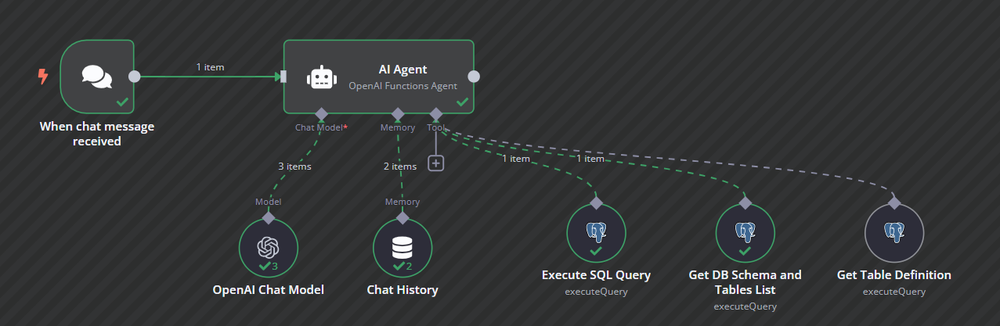
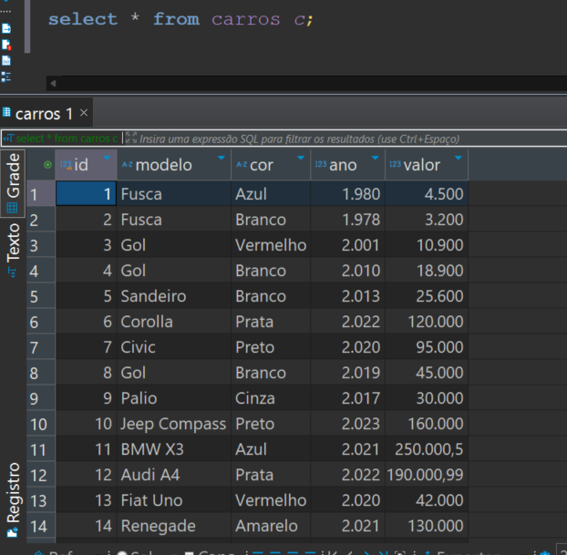

# Workflow com Agente de IA no n8n

Este repositório demonstra como utilizar um **Agente de IA integrado ao n8n** para realizar consultas inteligentes em um banco de dados PostgreSQL, usando como exemplo uma tabela chamada `carros`.

---

## 🔧 Como funciona o Workflow

Abaixo está o diagrama do workflow implementado no [n8n](https://n8n.io):

### 🔄 Etapas do Processo:

1. **Recebimento da Mensagem (Trigger)**
   - O fluxo inicia quando uma mensagem de chat é recebida.

2. **AI Agent (OpenAI Functions Agent)**
   - O agente de IA atua como cérebro do fluxo. Ele entende a intenção da mensagem e decide que ações tomar, usando:
     - **Chat Model (GPT-4)** para interpretar a mensagem.
     - **Memória de Chat** para manter contexto de conversas anteriores.
     - **Ferramentas** integradas ao agente para executar ações como consultar banco de dados.

3. **Consultas ao Banco de Dados (PostgreSQL)**
   - O agente pode:
     - Executar queries SQL (`Execute SQL Query`)
     - Obter a lista de tabelas e esquema (`Get DB Schema and Tables List`)
     - Ver a definição das colunas de uma tabela (`Get Table Definition`)

4. **Exemplo Prático**
   - Um usuário pode perguntar:
     > "Quais são os carros vermelhos disponíveis no estoque?"
   - O agente interpreta a pergunta, gera a SQL correta e retorna os dados diretamente da tabela `carros`.

---

## 📊 Sobre a Tabela `carros`

Este é apenas um exemplo. A tabela contém as seguintes colunas:
- `modelo` (texto)
- `cor` (texto)
- `ano` (inteiro)
- `valor` (decimal)

---

## 💼 Aplicações para Negócios

Esse mesmo fluxo pode ser adaptado para diversas áreas, por exemplo:
- **E-commerce**: Consultar produtos, preços e disponibilidade.
- **RH**: Obter informações de colaboradores.
- **Financeiro**: Gerar relatórios sob demanda.
- **Atendimento ao cliente**: Responder perguntas frequentes com base em dados reais.

Os Agentes de IA no n8n permitem que você conecte linguagem natural (como perguntas em português) diretamente a sistemas internos e bancos de dados — sem a necessidade de escrever código manualmente a cada consulta.

---

## 🚀 Benefícios

- Interface de conversa natural
- Respostas em tempo real com dados atualizados
- Escalável para múltiplos domínios de negócio
- Fácil de integrar com outros sistemas via n8n
